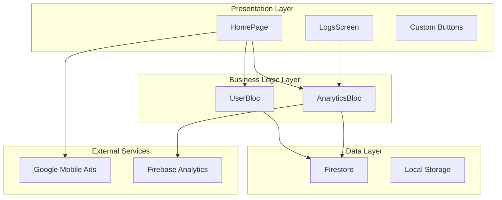
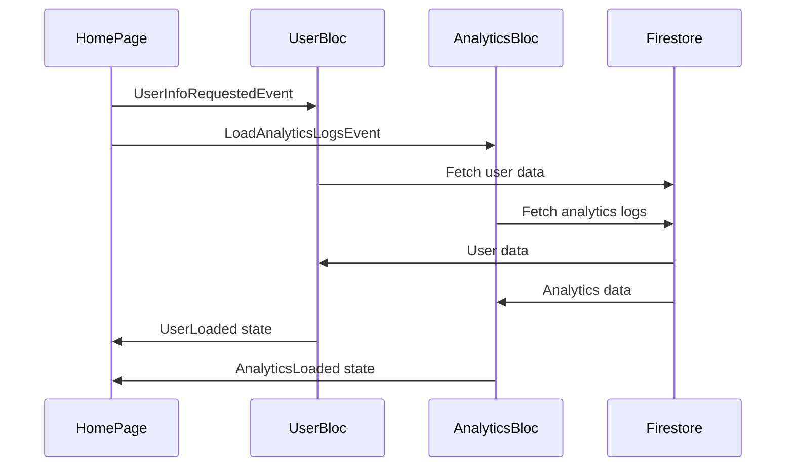

#  WrapSafar Developer Task Submission

##  Developer Information
- **Name:** Abdul Haseeb  
- **Role:** Flutter App Developer  
- **Submission Date:** `14th June 2025`  

##  Completed Tasks
- [x] Welcome screen implementation  
- [x] Ad viewer interface (watch ad, earn coin)  
- [x] Coin balance tracking system 
- [x] Firebase Analytics integration 

##  Technologies Used
- Flutter Framework  
- Dart Programming  
- Firebase (Firestore, Analytics)

##  Payment Details
- Expected payment: 5,000 PKR  
- Payment method: EasyPaisa (03491777261)  

# Wrap Safar Task

A Flutter application that demonstrates user management, analytics tracking, and rewarded advertisement integration using clean architecture principles and the BLoC pattern.

## Features

- **User Management**: Store and manage username, ads viewed count, and user scores [1](#0-0) 
- **Analytics Tracking**: Log events with success/failure status and additional information
- **Rewarded Advertisements**: Integration with Google Mobile Ads for rewarded ad experiences
- **Dynamic Theming**: Light and dark theme support with smooth transitions
- **Real-time Dashboard**: Analytics dashboard showing event statistics

## Architecture

The application follows clean architecture principles with BLoC pattern for state management:

## State Management Flow

## Dependencies

Key dependencies include: [2](#0-1) 

- `flutter_bloc`: State management
- `cloud_firestore`: Database integration  
- `google_mobile_ads`: Advertisement integration
- `provider`: Dependency injection and theme management
- `get_it`: Service locator pattern
- `equatable`: Value equality
- `dartz`: Functional programming utilities

## Project Structure

The application uses a feature-based folder structure with separation of concerns:

- `lib/presentation/`: UI components and BLoC integration
- `lib/domain/`: Business logic and entities
- `lib/data/`: Data sources and repositories
- `lib/core/`: Shared utilities and theme management
- `lib/services/`: External service integrations

